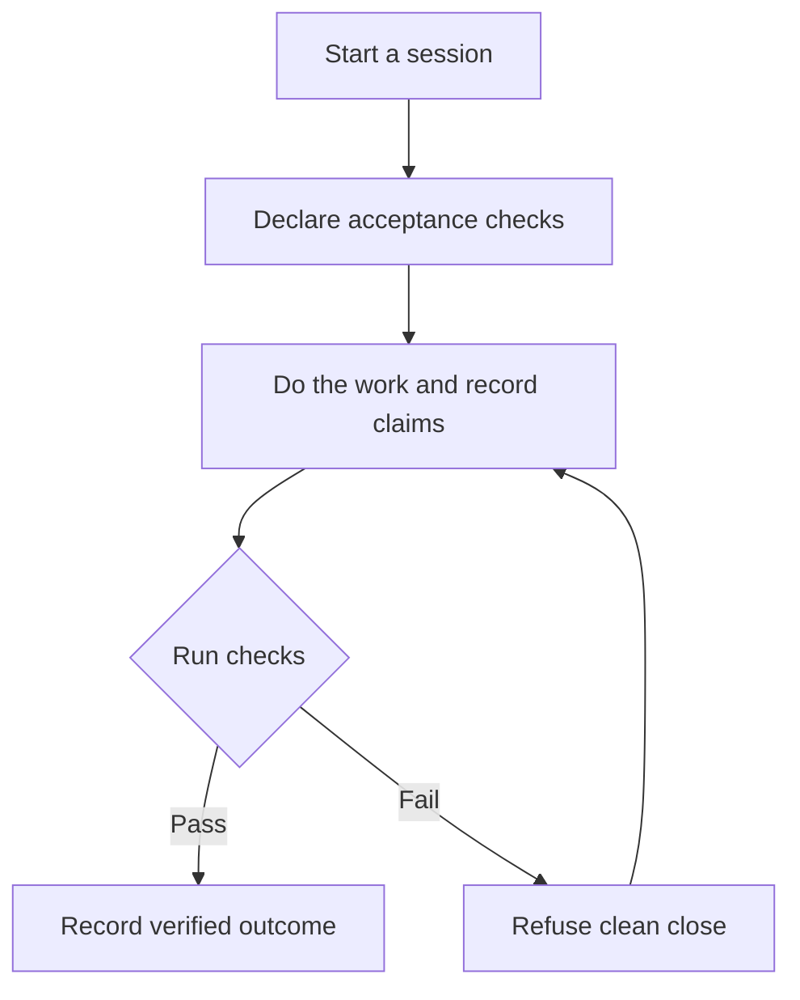

# showwork

Check what an AI agent says it completed.

[](https://github.com/bmdhodl/showwork/actions/workflows/ci.yml)
[](https://pypi.org/project/showwork/)
[](https://pypi.org/project/showwork/)
[](LICENSE)

showwork records an agent's claims and runs deterministic checks. Its exit gate
refuses a clean outcome close when declared acceptance checks fail.
Each session keeps its own append-only, hash-chained receipt.

Python 3.10 or newer. No runtime dependencies. MIT licensed.

**A passing check only proves what it tests.** Showwork cannot judge whether
a requirement covers your request or a test matches its description.
Read the [evidence-scope incident](docs/evidence-scope.md) for an example of
that limit in our own use.

## Quickstart

Use a new empty directory. The first close deliberately fails because the
claimed file does not exist.

```bash
python -m pip install showwork
```

`python -m showwork` is the same CLI after install. Use it if `showwork`
is not on PATH. The commands below use Bash quoting.

```bash
showwork start --session first-look --agent cursor
showwork require --session first-look --id config --scope artifact --description 'config/api.yaml exists' --check-json '{"type":"file_exists","path":"config/api.yaml"}'
showwork claim --session first-look --claim "config/api.yaml exists" --type file_exists --path config/api.yaml
showwork finish --session first-look --status ok
```

Expected: exit code `2`, a `RED` claims verdict, and a `REFUSED` message.
The failed close is part of this example.

Create the file, retract the premature claim, and record a new one:

```bash
python -c "from pathlib import Path; p=Path('config'); p.mkdir(exist_ok=True); (p/'api.yaml').write_text('timeout: 30\n')"
showwork retract --session first-look --claim "config/api.yaml exists" --reason "file was not written yet"
showwork claim --session first-look --claim "config/api.yaml exists" --type file_exists --path config/api.yaml
showwork finish --session first-look --status ok
```

Expected: exit code `0` and `Outcome: VERIFIED`.
This proves one artifact requirement. It proves no application behavior.

Inspect the session:

```bash
showwork verify --session first-look --json
showwork audit
```

For a shell-independent example, see the
[Python quickstart](docs/quickstart-python.md).

## How it works



Text equivalent: start, declare what must pass, do the work, record claims,
and run the checks. Failed checks refuse a clean close. Fix the work or
close as blocked; corrections append new records.

- **Artifact checks** observe files, paths, or other declared state.
- **Behavior checks** run declared test commands.
- **Session snapshots** detect changed or deleted files that active claims
  do not name, within the snapshot's scope.
- **Receipt checks** verify the chain and, when required, that Git tracks
  the session's evidence.

Distinct session slugs write distinct files under `.showwork/sessions/` and
`.showwork/claims/`. Reusing one slug requires one writer.
See [concurrency](docs/concurrency.md) and the
[`spec-v0.5` ledger specification](SPEC.md).

## Add it to a repository

```bash
showwork init
```

Review the generated Cursor rule, Claude Code Stop hook, and CI draft at
`docs/ci/showwork-verify.yml`. Copy the CI draft into `.github/workflows/`
when ready. The Stop hook observes results; the explicit finish or CI gate
enforces a close.

[Cursor walkthrough](docs/walks/cursor.md) ·
[Claude Code adapter](docs/claude-code.md) ·
[CI setup](docs/ci.md)

## Check types

| Type | What it checks |
| --- | --- |
| `file_exists` | A file exists |
| `file_contains` | A file matches, or does not match, a regular expression |
| `path_moved` | The source is gone and the destination exists |
| `frontmatter` | A frontmatter field has the expected value |
| `glob_count` | A path count meets the declared comparison |
| `command` | An allowed Python script exits as expected |
| `http_probe` | An HTTP response has the expected status and optional text |
| `git_state` | The local Git state matches declared conditions |

Use `showwork <command> --help` for your installed CLI.
The [specification](SPEC.md) defines check shapes and records;
[CI documentation](docs/ci.md) explains command and network permissions.

## Limits and trust

- Showwork verifies declared checks, not whether the work satisfies every
  part of the user's request. Requirements and tests still need review.
- A passing command can contain a weak test. A text match cannot prove
  application behavior.
- Hash chains detect changes relative to retained history or a trusted
  head hash. They do not prevent an attacker from replacing an entire
  unanchored ledger.
- Command restrictions are not a sandbox. Run untrusted code only in an
  appropriate isolated environment. Network checks are off by default
  in the GitHub Action.
- Receipts can contain paths and application data. Review them before
  publishing.
- Historical measurements describe their selected corpus. They are not
  a general detection rate or a compliance certification.

See [evidence scope](docs/evidence-scope.md),
[legacy ledger migration](docs/legacy-baseline.md), and the
[dated case study](docs/case-study.md).

## Documentation and help

| You want to | Start here |
| --- | --- |
| Find guides and references | [Documentation index](docs/README.md) |
| Run a quickstart on Windows or another shell | [Python quickstart](docs/quickstart-python.md) |
| Gate CI on committed receipts | [CI guide](docs/ci.md) |
| Wrap an agent command | [Adapters](docs/adapters.md) |
| Read or implement the ledger format | [Specification](SPEC.md) |
| Review measured results | [Case study](docs/case-study.md) and [measurement method](docs/false-done-rate.md) |
| Navigate with an AI assistant | [AI documentation index](llms.txt) |
| Contribute | [Contributing](CONTRIBUTING.md) |
| Inspect releases | [Changelog](CHANGELOG.md) |

Every pull request carries the committed `.showwork/` receipt for the session
that produced it. A pull request without one is not reviewed.
Read [CONTRIBUTING.md](CONTRIBUTING.md) for setup and the receipt gate.

Maintained by [Patrick Hughes](https://github.com/bmdhodl).
[Report a bug](https://github.com/bmdhodl/showwork/issues) with the version,
a minimal reproduction, and the expected result. Report vulnerabilities
privately using the [contribution guide](CONTRIBUTING.md#security).

README quickstart commands and documentation links are checked in CI.
Source metadata defines the branch version; the PyPI badge links to the
published release. [MIT license](LICENSE).
